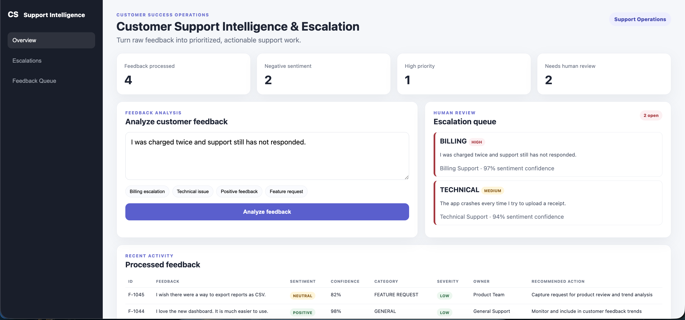
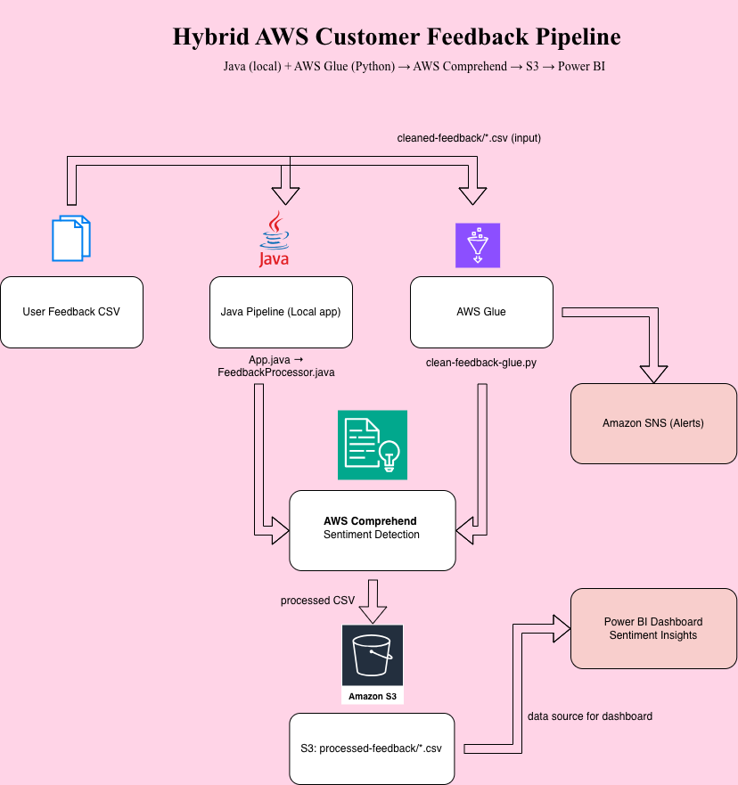
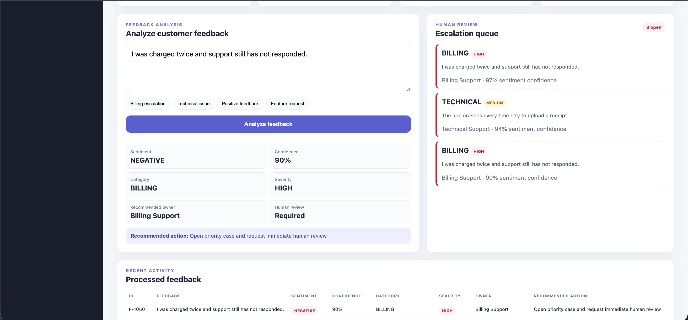

# AI Customer Support Intelligence & Escalation Platform

## Overview

This project is a serverless AWS customer-support intelligence platform that transforms raw customer feedback into structured, prioritized, and actionable support data.

The system combines batch ETL, event-driven processing, managed NLP, deterministic business rules, persistence, and escalation workflows.

It is designed to answer operational questions such as:

- What type of issue is the customer reporting?
- How severe is the issue?
- Which team should own it?
- What action should happen next?
- Does the case require human review?

The platform uses:

- AWS Glue + Python for data validation and ETL
- Amazon S3 for raw, cleaned, and processed feedback storage
- AWS Lambda for event-driven processing
- Java for feedback enrichment and routing logic
- Amazon Comprehend for sentiment analysis
- Amazon DynamoDB for enriched feedback records
- Amazon SNS for high-priority escalation alerts
- a support operations dashboard for visibility into feedback, priorities, routing, and escalations

---
## Platform Preview



The support operations dashboard provides visibility into feedback volume, sentiment, severity, recommended ownership, and cases requiring human review.

## Architecture



---

## Business Problem

Customer feedback can come from many sources, including surveys, forms, CSV exports, support systems, and application feedback.

Before support teams can act on this data, they need to solve several problems:

- inconsistent source formats
- incomplete or malformed records
- duplicate feedback
- large volumes of unstructured text
- unclear ownership
- inconsistent prioritization
- delayed escalation of important customer issues

This project provides an end-to-end workflow that prepares incoming feedback, applies AI-assisted analysis, enriches each record with business context, and routes important cases for human review.

---

## Architecture

```text
Customer Feedback
        │
        ▼
┌─────────────────────────┐
│       Amazon S3         │
│       Raw Data Zone     │
└────────────┬────────────┘
             │
             ▼
┌─────────────────────────┐
│ AWS Glue + Python ETL   │
│                         │
│ • Schema validation     │
│ • Null handling         │
│ • Column normalization  │
│ • Duplicate removal     │
│ • Text cleanup          │
└────────────┬────────────┘
             │
             ▼
┌─────────────────────────┐
│       Amazon S3         │
│     Cleaned Data Zone   │
└────────────┬────────────┘
             │
             │ S3 Event
             ▼
┌─────────────────────────┐
│       AWS Lambda        │
│      LambdaHandler      │
└────────────┬────────────┘
             │
             ▼
┌─────────────────────────┐
│ Java FeedbackProcessor  │
└────────────┬────────────┘
             │
             ▼
┌─────────────────────────┐
│   Amazon Comprehend     │
│                         │
│ • Sentiment             │
│ • Confidence score      │
└────────────┬────────────┘
             │
             ▼
┌──────────────────────────────┐
│ Business Rules Layer         │
│                              │
│ • Category                   │
│ • Severity                   │
│ • Recommended owner          │
│ • Recommended action         │
│ • Escalation decision        │
└──────────────┬───────────────┘
               │
       ┌───────┴────────┐
       ▼                ▼
┌──────────────┐  ┌──────────────┐
│  DynamoDB    │  │ Amazon SNS   │
│              │  │              │
│ Enriched     │  │ Escalation   │
│ records      │  │ alerts       │
└──────┬───────┘  └──────────────┘
       │
       ▼
┌──────────────────────────────┐
│ Support Operations Dashboard │
│                              │
│ • Feedback queue             │
│ • Sentiment                  │
│ • Confidence                 │
│ • Severity                   │
│ • Routing                    │
│ • Recommended action         │
│ • Escalation visibility      │
└──────────────────────────────┘
```

---

## Processing Flow

### 1. Raw Feedback Ingestion

Customer feedback is stored in an Amazon S3 raw-data zone.

The architecture supports CSV-based feedback from sources such as:

- customer surveys
- exported support data
- feedback forms
- review datasets
- application feedback

---

## 2. AWS Glue ETL and Data Quality

The Python Glue job prepares incoming feedback before it reaches the operational processing layer.

### Responsibilities

The ETL process:

- discovers incoming CSV files
- normalizes column names
- standardizes different feedback field names
- validates required fields
- removes empty or invalid rows
- removes duplicate feedback IDs
- normalizes whitespace
- attaches processing metadata
- writes validated records to the cleaned S3 zone
- reports processing metrics

Example normalized output:

```csv
id,feedback,processing_status,source
1001,I was charged twice and need help.,VALIDATED,customer_feedback
1002,The application crashes during upload.,VALIDATED,customer_feedback
```

Separating data preparation from downstream processing prevents malformed records from reaching the customer-support workflow.

---

## 3. Event-Driven Processing with AWS Lambda

When a validated CSV file is written to the cleaned S3 path, an S3 event can invoke the Java Lambda handler.

`LambdaHandler.java` acts as the serverless entry point.

Its responsibilities are intentionally limited to:

1. receiving the S3 event
2. identifying the source bucket and object
3. verifying that the object belongs to the cleaned-feedback path
4. validating that the object is a CSV
5. delegating processing to `FeedbackProcessor`

This keeps orchestration separate from the business-processing logic.

---

## 4. AI-Assisted Sentiment Analysis

`FeedbackProcessor.java` sends each validated customer comment to Amazon Comprehend.

The processor captures:

- sentiment
- sentiment confidence

Possible sentiment values include:

```text
POSITIVE
NEGATIVE
NEUTRAL
MIXED
```

Example:

```text
Sentiment: NEGATIVE
Confidence: 97%
```

The model output is then combined with deterministic business rules.

---

## 5. Customer Issue Categorization

The platform categorizes customer feedback into operational issue types.

Examples include:

```text
BILLING
ACCOUNT_ACCESS
TECHNICAL
CUSTOMER_SUPPORT
FEATURE_REQUEST
GENERAL
```

This enables feedback to be routed to the team best positioned to respond.

---

## 6. Severity Classification

Each record receives a severity level:

```text
LOW
MEDIUM
HIGH
```

High-impact indicators can include:

- duplicate charges
- suspected fraud
- account lockouts
- inability to access an account
- data loss
- security issues
- urgent customer-impacting problems

Negative feedback that does not meet a high-severity rule can still be classified as medium priority.

---

## 7. Recommended Owner and Action

The system maps issue categories to an appropriate support owner.

Examples:

| Category | Recommended Owner |
|---|---|
| BILLING | Billing Support |
| ACCOUNT_ACCESS | Account Support |
| TECHNICAL | Technical Support |
| CUSTOMER_SUPPORT | Customer Success |
| FEATURE_REQUEST | Product Team |
| GENERAL | General Support |

The system also generates a deterministic recommended next action.

Examples:

```text
Review payment history and follow up with the customer

Verify account status and initiate account recovery support

Create a technical support case with the reported error context

Assign to Customer Success for follow-up

Capture request for product review and trend analysis
```

---

## 8. Human-in-the-Loop Escalation

The platform intentionally keeps humans involved in high-impact customer situations.

Cases can be marked for escalation based on severity and sentiment.

Example:

```text
Customer Feedback:
I was charged twice and support still has not responded.

Sentiment:
NEGATIVE

Confidence:
97%

Category:
BILLING

Severity:
HIGH

Recommended Owner:
Billing Support

Recommended Action:
Open priority case and request immediate human review

Needs Escalation:
true
```

When escalation criteria are met, Amazon SNS publishes an alert containing relevant context for the support team.

### High-Priority Escalation



---

## DynamoDB Enriched Record

Processed feedback is stored in Amazon DynamoDB.

Example:

```json
{
  "FeedbackID": "F-1042",
  "FeedbackText": "I was charged twice and support still has not responded.",
  "Sentiment": "NEGATIVE",
  "SentimentConfidence": 0.97,
  "Category": "BILLING",
  "Severity": "HIGH",
  "RecommendedOwner": "Billing Support",
  "RecommendedAction": "Open priority case and request immediate human review",
  "NeedsEscalation": true,
  "Status": "SUCCESS"
}
```

The enriched data model makes records usable by downstream dashboards, support tools, analytics systems, or future integrations.

---

## Support Operations Dashboard

The project includes a lightweight dashboard focused on customer-support operations.

The dashboard displays:

- total feedback processed
- negative feedback count
- high-priority case count
- cases requiring human review
- sentiment
- sentiment confidence
- category
- severity
- recommended owner
- recommended action
- escalation queue
- processed feedback history

The dashboard provides an operational view of the decisions produced by the feedback-processing workflow.

---

## Why Combine AI with Deterministic Rules?

The system intentionally does not rely entirely on AI.

Amazon Comprehend is used for probabilistic language analysis:

```text
sentiment
confidence
```

Deterministic business rules control operational decisions:

```text
category
severity
routing
recommended action
escalation
```

This hybrid approach allows the platform to benefit from managed NLP while keeping important customer-support decisions predictable, explainable, and testable.

---

## Why Use Separate ETL and Processing Stages?

The Glue ETL workload and the operational feedback-processing workload solve different problems.

### AWS Glue + Python

Best suited for:

- batch ingestion
- validation
- normalization
- duplicate handling
- data-quality preparation

### Lambda + Java

Best suited for:

- event-driven execution
- Amazon Comprehend integration
- business logic
- routing
- persistence
- escalation

Separating these responsibilities also makes failures easier to isolate and allows data-quality processing to be rerun without automatically generating support alerts.

---

## Project Structure

```text
project1-feedback-analysis/
│
├── Python/
│   └── clean-feedback-glue.py
│
├── src/
│   ├── main/
│   │   └── java/
│   │       └── com/
│   │           └── farina/
│   │               └── feedback/
│   │                   ├── FeedbackProcessor.java
│   │                   └── LambdaHandler.java
│   │
│   └── test/
│       └── java/
│           └── com/
│               └── farina/
│                   └── feedback/
│                       └── AppTest.java
│
├── dashboard/
│   ├── index.html
│   ├── styles.css
│   └── script.js
│
├── data/
│   ├── raw/
│   └── processed/
│
├── docs/
│   ├── architecture.png
│   ├── sample-output.json
│   ├── test-scenarios.md
│   └── screenshots/
│       ├── dashboard-overview.png
│       └── high-priority-escalation.png
│
├── pom.xml
└── README.md
```

---

## AWS Services

| Service | Purpose |
|---|---|
| Amazon S3 | Raw, cleaned, and processed feedback storage |
| AWS Glue | Batch ETL and data-quality processing |
| AWS Lambda | Event-driven processing |
| Amazon Comprehend | Managed sentiment analysis |
| Amazon DynamoDB | Storage for enriched feedback |
| Amazon SNS | Escalation notifications |
| AWS IAM | Service permissions and access control |

---

## Technologies

### Languages

- Java 17
- Python
- JavaScript
- HTML
- CSS

### AWS

- Amazon S3
- AWS Glue
- AWS Lambda
- Amazon Comprehend
- Amazon DynamoDB
- Amazon SNS
- AWS IAM

### Data Processing

- pandas
- Apache Commons CSV
- schema validation
- normalization
- duplicate handling

### Development

- Maven
- JUnit 5
- AWS SDK for Java

---

## Build

The Java project is built using Maven:

```bash
mvn clean package
```

The build:

- compiles the Java processor
- compiles the Lambda handler
- runs JUnit tests
- packages AWS dependencies
- produces a shaded JAR for deployment

---

## Running the Dashboard

From the dashboard directory:

```bash
python3 -m http.server 8001
```

Open:

```text
http://localhost:8001
```

---

## Design Decisions

### Managed NLP

Amazon Comprehend provides sentiment analysis without requiring custom model training, hosting, or inference infrastructure.

### Event-Driven Processing

AWS Lambda allows processing to begin when validated data arrives in Amazon S3.

### Separation of Concerns

Each major component has a focused responsibility:

```text
Glue        → data quality
Lambda      → event orchestration
Java        → processing and business logic
Comprehend  → NLP analysis
DynamoDB    → persistence
SNS         → escalation
Dashboard   → operational visibility
```

### Human Review

High-impact customer issues are routed to humans instead of being fully automated.

---

## Production Improvements

Future production enhancements could include:

- SQS buffering between S3 and Lambda
- dead-letter queues
- idempotency for duplicate S3 events
- automatic retry policies
- structured CloudWatch logging
- custom CloudWatch metrics and alarms
- infrastructure as code
- integration and end-to-end tests
- configurable routing rules
- low-confidence model handling
- API-backed dashboard data
- CRM or ticketing-system integration
- dashboard authentication and RBAC
- historical analytics
- SLA tracking
- support-resolution metrics

---

## Skills Demonstrated

This project demonstrates practical experience with:

- AWS cloud architecture
- serverless systems
- event-driven processing
- ETL pipelines
- Java AWS SDK development
- Python data engineering
- managed AI/NLP services
- data validation and cleaning
- support-workflow automation
- customer issue prioritization
- routing and ownership logic
- human-in-the-loop AI
- DynamoDB persistence
- SNS notifications
- frontend dashboard development
- Maven build tooling
- unit testing
- separation of concerns
- production-oriented architecture design

---

## End-to-End Flow

```text
Raw Customer Feedback
        ↓
Data Validation
        ↓
Cleaned Feedback
        ↓
Event-Driven Processing
        ↓
AI Sentiment Analysis
        ↓
Business Rules
        ↓
Priority + Routing + Action
        ↓
Persistence
        ↓
Human Escalation
        ↓
Operational Visibility
```

The platform demonstrates how unstructured customer feedback can be transformed into structured customer-support actions using a combination of AWS managed services, Java, Python, and deterministic workflow logic.
